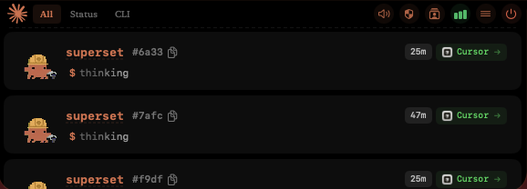

# Oh My Island

A Dynamic Island for your AI coding agents on macOS.

Monitor Claude Code, Codex, Gemini CLI, Cursor, and more — right from your MacBook's notch.



## Features

- **Real-time session monitoring** — See all your AI agent sessions in one glance
- **Permission approval** — Approve or deny tool permissions without switching windows
- **Question answering** — Answer agent questions directly from the notch
- **Terminal jump** — Click to jump to the exact terminal window/tab/pane (13+ terminals supported)
- **Usage tracking** — Monitor API usage across Claude, Codex, Gemini, Cursor with OAuth integration
- **Membership tiers** — Earn tier ranks (Newcomer → Legend) based on usage time
- **8-bit sound effects** — Configurable sounds for session events
- **Environment safety check** — Detect VPN, CI/CD, SSH and other risk factors
- **Multi-agent support** — Claude Code, Codex, Gemini CLI, Cursor, Qoder, Factory, CodeBuddy, OpenCode

## Install

### From DMG
1. Download the latest DMG from [Releases](https://github.com/taoweiy431-boop/oh-my-island/releases)
2. Open the DMG and drag "Oh My Island" to Applications
3. First launch: **Right-click** the app → **Open** → Click **Open** in the dialog
4. (Or run `sudo xattr -r -d com.apple.quarantine /Applications/Oh\ My\ Island.app`)

> The app is not notarized (no Apple Developer certificate). Right-click → Open bypasses Gatekeeper for the first launch.

### From Source
```bash
git clone https://github.com/taoweiy431-boop/oh-my-island.git
cd oh-my-island
swift build
.build/arm64-apple-macosx/debug/OhMyIsland
```

## Requirements

- macOS 14+
- Apple Silicon or Intel

## Build

```bash
swift build
```

## Run

```bash
.build/arm64-apple-macosx/debug/CodeIsland
```

## Preview Mode

```bash
.build/arm64-apple-macosx/debug/CodeIsland --preview multi
```

Available scenarios: `working`, `approval`, `question`, `completion`, `multi`, `busy`, `claude`, `codex`, `gemini`, `cursor`, `allcli`, `stress`

## Tech Stack

- Pure Swift + SwiftUI
- Lottie for character animations
- Unix domain socket for CLI communication
- No Electron, under 50MB RAM

## Credits

- Inspired by [CodeIsland](https://github.com/wxtsky/CodeIsland)
- Clawd pixel art animations by [冗余集](https://www.xiaohongshu.com/user/profile/95043843613) (小红书)

## License

MIT — see [LICENSE](LICENSE)
